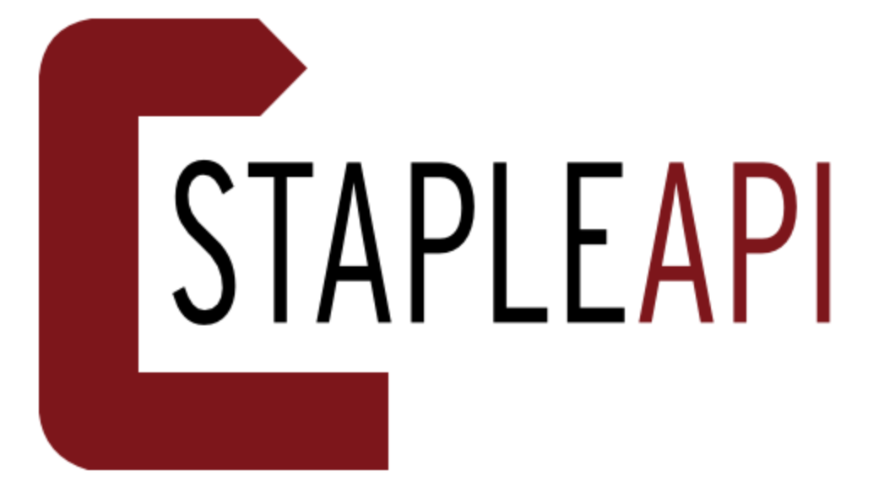
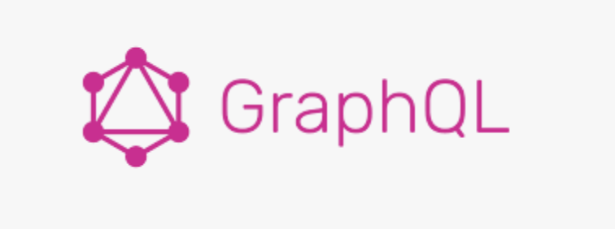

# 2K-KG

Course Project of DSCI558: Knowledge Graph

## Overview

2KKG is a simple knowledge graph applications using \_\_\_ data managed entirely via a GraphQL layer. It involves:

1. \_\_\_ data (from 2KDB, NBA Official, Wikipedia) stored in a free-tire MongoDB Atlas instance.

 
  

2. Staple API -- a lightweight GraphQL-based API for managing knowledge graphs on top of different data storage back-ends.

 
 

3. vis.js -- a front-end graph [visualization](https://visjs.github.io/vis-network/examples/network/nodeStyles/circularImages.html) tool.

 

4. A machine learning engine \_\_\_ to allow users make predictions while browsing the knowledge graph.
5. (Optional) Repl.it IDE environment -- to deploy the 2KKG app.

## To build 2K-KG:

1. Change MongoDB Config inside `demo.js`

    create a file named `secret.js` and type

    ```
    function define(name, value) {
        Object.defineProperty(exports, name, {
            value: value,
            enumerable: true,
        });
    }

    define('mongoDBPassword', 'CHANGE_TO_YOUR_OWN_PASSWORD');
    ```

2. `npm install`

3. `node demo.js`

    Warning: if run first time, need to `npm dedupe` when saw error _"Error: Cannot use GraphQLSchema "[object GraphQLSchema]" from another module or realm."_ then `node demo.js` again.

## To set up Apache Jena Fuseki (Sparql Query Engine)

`./apache-jena-fuseki-4.6.1/fuseki-server --file=./data.nt --localhost /ds `

### Deployment

1. Go to [Repl.](https://replit.com/~)

2. Create a Repl with `node.js` or click `import from github` with link https://github.com/rzhu1999/2K-KG
   `npm install`

3. Click `Run`

    Warning: if run first time, need to `npm dedupe` when saw error "Error: Cannot use GraphQLSchema "[object GraphQLSchema]" from another module or realm." then click `Run` again.

## Domain

NBA 2K is a sports simulation game for basketball and has been the Sports Game of the Year for a couple of years. It uses real-life NBA players' data plus some unique features such as 2K ratings & skill badges of each player. Badges are an attribute of a player’s signature skills, personality, special abilities, and advantages.

The purpose of making this knowledge graph is to aggregate and collect information both in reality and in the 2K game about NBA players. This knowledge graph allows users to understand players' characteristics and performances better.

### 2. Staple API

Staple API takes a specified RDF ontology, a configuration of the back-end source, and automatically spins-up a ready GraphQL service, with a a corresponding schema and resolvers.

## Ref for developers

[Creating KG App](https://levelup.gitconnected.com/knowledge-graph-app-in-15min-c76b94bb53b3)

[Predict future stats](https://towardsdatascience.com/predicting-the-outcome-of-nba-games-with-machine-learning-a810bb768f20)
